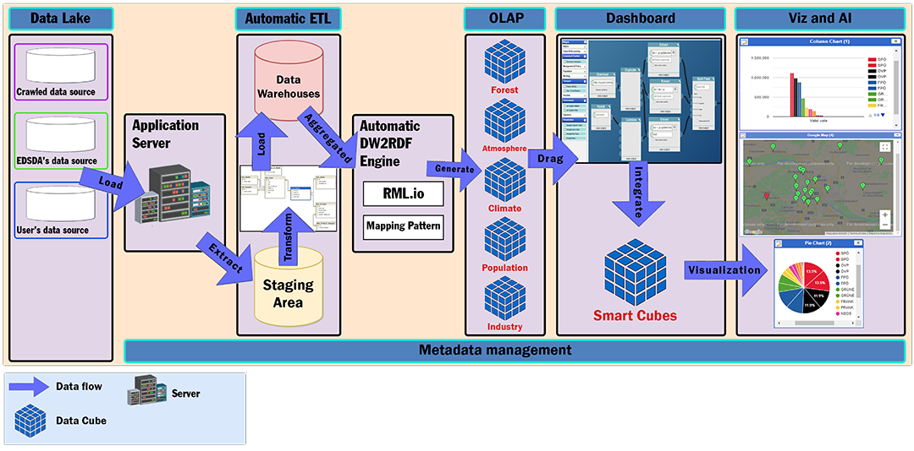
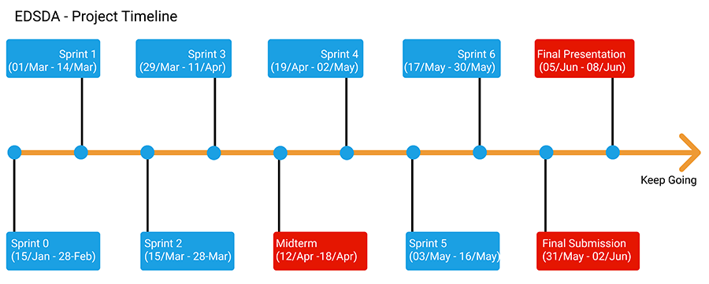

# Scientific Research : EDSDA - Expert-driven Smart Dashboard Application

## Date: Mar 2021 - Jun 2021

### Introduction

- Scientific Research about Linked Data & RDF Data Cube & Data Warehouse
- Automate data processing which help the experts of every fields can insert their data sources and visualize, integrate them with related multidimensional data cubes by completely automate method.

### Context Diagram:



### Progress Project



### Folder Structure:

```
/modules:
  /edsda-webapp
  /edsda-backend
  /edsda-ui-design
  /edsda-etl
```

- `modules`: include all the project's source code, divided into each module
- `edsda-webapp`: source code of Client website
- `edsda-backend`: source code of server: API, DW2RDF,...
- `edsda-etl`: source code of ETL process, data sources, data warehouse...
- `edsda-ui-design`: UI Design, Prototype of project

## Members:

| Avatar                                                   | Name                | Role                                                          | Contact                    |
| -------------------------------------------------------- | ------------------- | ------------------------------------------------------------- | -------------------------- |
|   | Vo Van Hoa          | **Team Leader**, DevOps, Back-end: server API, RDF Data Cubes | hoavo1490@gmail.com        |
|   | Pham Van Tin        | Front-end, UI/UX Design, DevOps                               | www.tinspham.info          |
|  | Ky Huu Dong         | Back-end: Crawl, ETL                                          | kyhuudong@gmail.com        |
|  | Tran Thi Thanh Kieu | Tester                                                        | thanhkieutran391@gmail.com |

## Contributing:

Contributions are very welcome and wanted.<br>
To submit your custom pull request, please make sure you read our CONTRIBUTING guidelines.

**Before submitting a new pull request, please make sure:**

- You have updated the package.json version and reported your changes into the CHANGELOG file
- make sure you've added the documentation of your changes.
