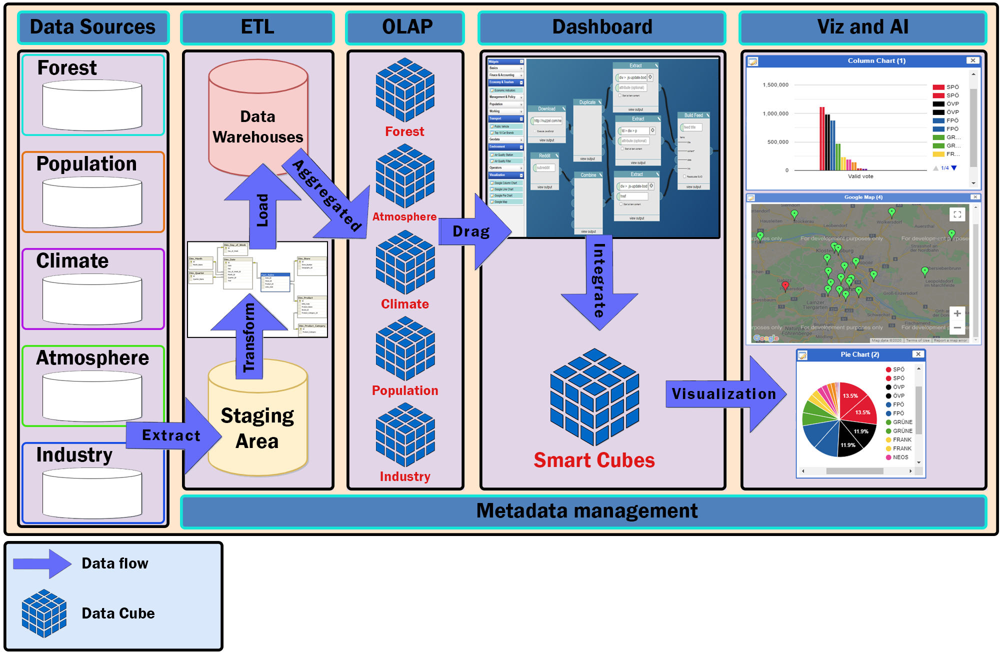

# Scientific Research : Smart Dashboard Application

## Date: Aug 2020 - Present

# English:

### Introduction

- Scientific Research about Linked Data & RDF Data Cube & Data Warehouse
- Apply multi-dimensional data cubes to synthesize, analyze, filter, and visualize data in the environment (climate, population, industry,...) of Vietnam

### Progress & Result of Project

To 31-Dec-2020, SDA are provide & visualize data cubes on the following elements of each province in Vietnam by year (2012-2019):

- Climate: Temperature, Humidity, Rainfall
- Population
- Industry
- Forest: Forest Cover Area, Afforestation

### Context Diagram:


## Folder Structure of version 2.0

```
/modules:
  /client:
  /server:
  /crawlers:
  /data_wranglers:

```

- `modules`:
- `client`:
- `server`:
- `crawlers`:
- `data_wranglers`:

# Vietnamese:

## Giới thiệu về SDA

- Nghiên cứu công nghệ dữ liệu Linked Data và RDF Data Cube và nền tảng Data Warehouse (kho dữ liệu).
- Ứng dụng công nghệ Khối dữ liệu nhiều chiều vào việc tổng hợp, phân tích, lọc và trực quan hóa dữ liệu về môi trường (khí hậu, dân số, nền công nghiệp,...) của Việt Nam.

## Tiến độ và kết quả dự án

Tính đến ngày 31-12-2020, SDA cung cấp và trực quan hoá các khối dữ liệu về các yếu tố sau của từng tỉnh thành tại Việt Nam theo năm (2012-2019):

- Khí hậu: Nhiệt độ, độ ẩm, lượng mưa.
- Dân số
- Chỉ số sản xuất công nghiệp
- Tài nguyên rừng: Độ che phủ rừng, Diện tích trồng rừng.

### Nhận xét của Mentor về dự án ở version hiện tại (1.0)

Đóng góp chính của đề tài:

- Thiết kế và xây dựng hệ thống tích hợp dữ liệu (web).
- Thiết kế và tạo lập thành công RDF data cubes, đây là cơ sở nền tảng cho việc kết nối các khối dữ liệu một các có ngữ nghĩa.
- Xây dựng được công cụ - phần mềm (ở mức thử nghiệm) Smart Dashboard Application, hỗ trợ việc phân tích dữ liệu một cách trực quan.

Đề xuất:

1. Hoàn chỉnh công cụ tích hợp dữ liệu Web để có thể tự tìm kiếm nguồn và tích hợp theo chủ đề.
2. Xây dựng công cụ quản lý RDF data cubes.
3. Phần mềm Smart Dashboard phải hỗ trợ tạo lập chủ đề một cách linh động. Do đó phải tách bạch 2 bước: định nghĩa mô hình, siêu dữ liệu theo chủ đề , và bước sản sinh dữ liệu.

## Cấu trúc dự án hiện tại


## Cấu trúc thư mục version 2.0

```
/modules:
  /client:
  /server:
  /crawlers:
  /data_wranglers:

```

- `modules`: chứa toàn bộ mã nguồn cuả dự án, được chia theo từng modules
- `client`: mã nguồn cho website SDA
- `server`: mã nguồn cho webserver, xử lí API giữa client và database
- `crawlers`: mã nguồn quét dữ liệu
- `data_wranglers`: mã nguồn xử lí và làm sạch dữ liệu
