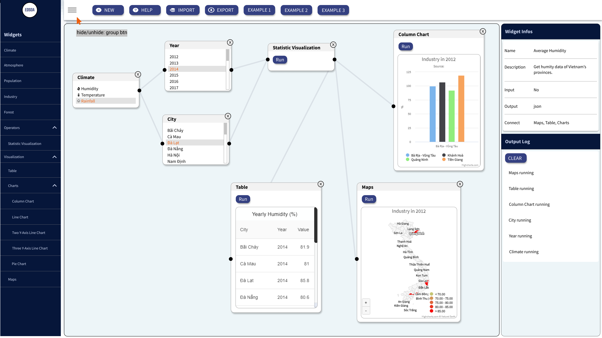

# Project: Client - EDSDA - Expert-driven Smart Dashboard Application

### Date: Mar 2021

### Functions

- Automate data processing which help the experts of every fields can insert their data sources and visualize, integrate them with related multidimensional data cubes by completely automate method.

### Screenshot

UI Design on Figma:



## Installation Guide

### Tech-Stack

- React Hooks
- react-router-dom
- redux-toolkit
- styled-components
- axios
- Material-UI
- react-icons
- [react-beautiful-diagrams](https://beautifulinteractions.github.io/beautiful-react-diagrams/)
- [react-dnd](https://github.com/react-dnd/react-dnd)
- [React Charts](https://react-charts.tanstack.com/docs/overview)
- Highcharts

### Directory Structure

updating....

```
.
├── .gitignore
├── package.json
├── package-lock.json
├── README.md
├── deploy-firebase
├── .firebaserc
├── firebase.json
├── public
└── src
```

For the project to build, these must exist with exact filenames:

### How to Deploy:

- surge install & surge login [Surge.sh](https://surge.sh/)

- Deploy on dev:

```
npm run deploy-dev
```

- Deploy on test:

```
npm run deploy-test
```

- Deploy on firebase:

```
firebase login
npm run deploy
```

### How to name a folder and a file

- Folder name: - Ex: `InfoSection`
- Component file name: should be -- Ex: `InfoSection.jsx`
- Style component file name: should be -- Ex: `InfoSection.elements.js`

### How to import and export module?

- Import:

```js
//import every thing
import * as React from "react";
import * as ReactDOM from "react-dom";

//for default export
import InfoSection from "./InfoSection";

//for named export
import { InfoSec, InfoRow } from "./InfoSection.elements";
```

### How to style for each component?

- Create a styled-component file. Ex: `InfoSection.elements.js`
- Import to `jsx` file

```js
// InfoSection.jsx

import { InfoSec, InfoRow } from "./InfoSection.elements";
```

### updating....
